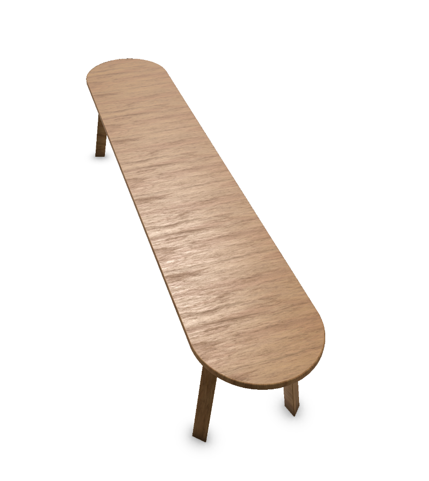

### Texture Map Examples

The additional texture maps should be named appropriately, indicating
the type of map it is. Later these maps will be placed in groups where
the user can change the material appropriately. So for example any
material that is called wood can be loaded onto a mesh named the same.

- Example: Wood material “Oak_001” should consist of two primary
  textures and an optional texture.

  - The first texture contains the Color map, and it is called
    “Oak\_\_001_Color.jpg”

  - The second texture contains the MetallicRoughness map, and it is
    called “Oak\_\_001_MetallicRoughness.jpg”

  - Optional third texture contains the Normal map, and it is called
    “Oak\_\_001_Normal.jpg”

  

Oak\_\_001 material using Oak\_\_001_Color.jpg and
Oak\_\_001_MetallicRoughness.jpg to give a realistic shine appropriate
to a wooden surface

- Example: Monitor Screen material “Monitor_Screen_001” can consist of
  two primary textures.

  - The first texture contains the Color map, and it is called
    “Monitor_Screen_001_Color.jpg”

  - first optional texture contains the Emissive map, and it is called
    “Monitor_Screen_001_Emissive.jpg”

  

Monitor_Screen\_\_001 material using Monitor_Screen\_\_001_Color.jpg and
Monitor_Screen\_\_001_Emissive.jpg shows a desktop example on the
monitor that is consistently bright and not affected by shadows due to
it’s emissive map.
