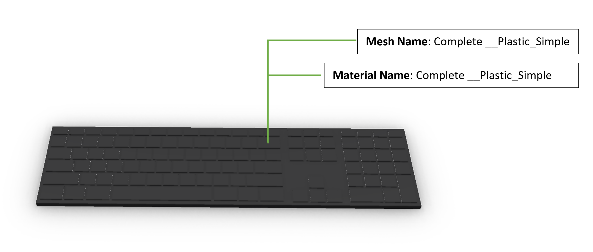
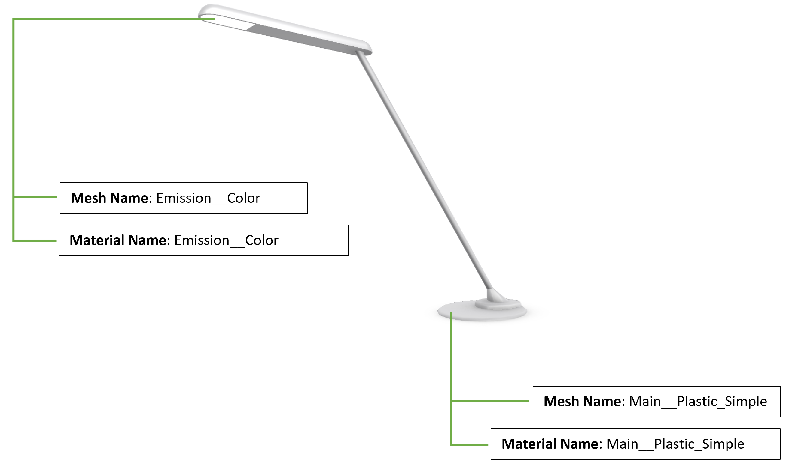
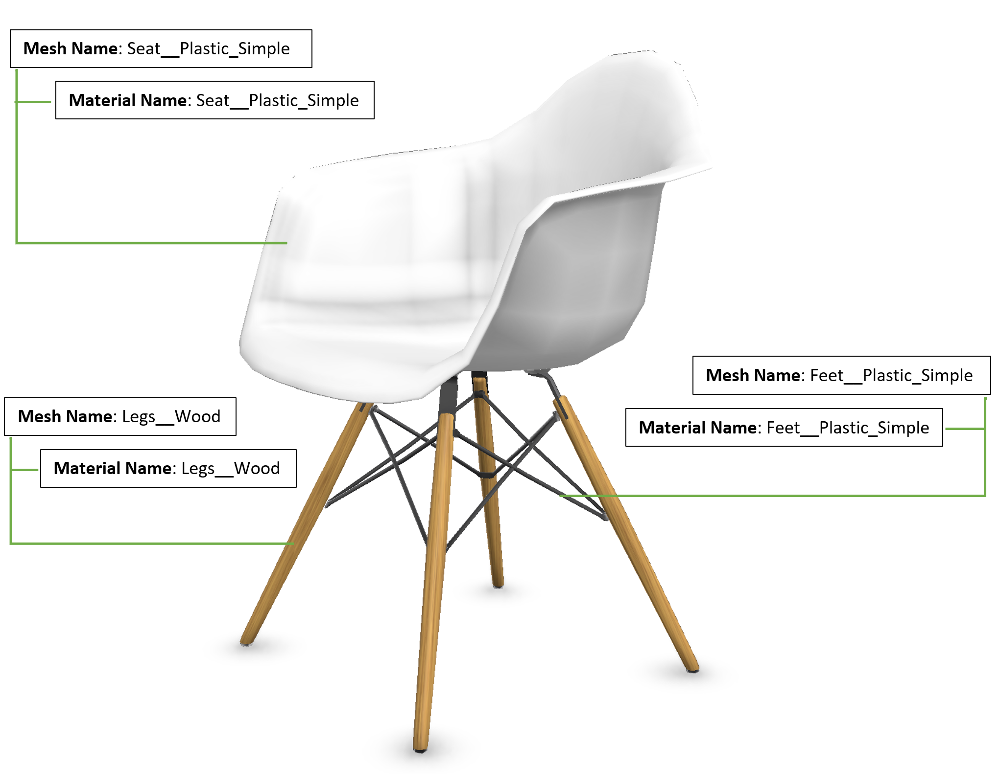
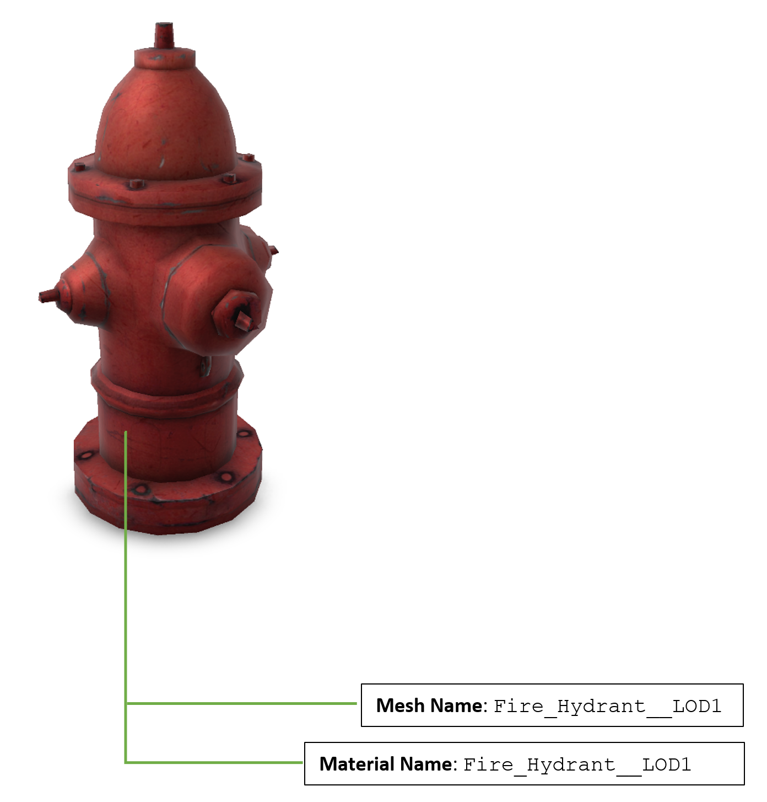
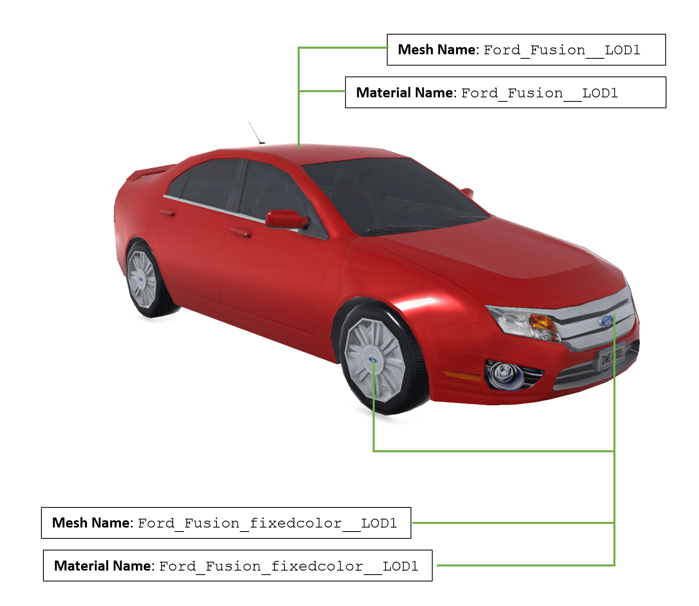

# Material and Group names 

## New Models

To give the user access so to change groups and their corresponding
materials, their names are initially matching so to be easier to access
and if desired, to edit. Excluding the inclusion of an “\_\_LODx” in the
group or material name, a double underscore is used so to easily parse
the name and access it’s material type through code or .cga rule. In
this instance “\_\_Plastic_Simple” – which can be set up to give users
access to a this material in its own library – **potentially to reside
in ESRI Lib.**

We have different examples below to indicate as to how this would work
depending on how many groups an asset has:

If an asset has only one group, it is named with the keyword
**Complete** unless it is part of a key asset type **(like Seating or
Tables):**

   > “Keyboard **Asset**",  
   > “Keyboard **Group Name**” -\> Complete\_\_Plastic_Simple,  
   > “Keyboard **Material Name**” -\> Complete\_\_Plastic_Simple

{width="100%"}

If an asset has more than one group, its’ primary keyword is **Main** or
in other situations to give access to an asset type more easily (like
Seating or Tables) named by its most prominent visual quality.

Main Example:

> “Holly Flute Personal Light **Asset**",  
> “Holly Flute Personal Light **Group** One Name" -\> Main\_\_Plastic_Simple,  
> “Holly Flute Personal Light **Material** One Name" -\> Main\_\_Plastic_Simple,  
> “Holly Flute Personal Light **Group** Two Name" -\> Emission\_\_Color,  
> “Holly Flute Personal Light **Material** Two Name" -\> Emission\_\_Color

{width="100%"}

Asset Type Example:

> “Eames_Plastic_Armchair_DAW **Asset**”  
> “Eames_Plastic_Armchair_DAW **Group** One Name” -\> Seat\_\_Plastic_Simple,  
> “Eames_Plastic_Armchair_DAW **Material** One Name” -\> Seat\_\_Plastic_Simple,  
> “Eames_Plastic_Armchair_DAW **Group** Two Name” -\> Legs\_\_Wood,  
> “Eames_Plastic_Armchair_DAW **Material** Two Name” -\> Legs\_\_Wood,  
> “Eames_Plastic_Armchair_DAW **Group** Three Name” -\> Feet\_\_Plastic_Simple,  
> “Eames_Plastic_Armchair_DAW **Material** Three Name” -\> Feet\_\_Plastic_Simple

An example of an asset with more than one group but which will be
accessible in a subdirectory like **Table or Seat**:

{width="100%"}

## Legacy Models

In the past many legacy models were made using texture materials to
indicate detail. **Their personalized textures were an amalgamation of
details specific to that asset model** – so they couldn’t be used again
on another model nor could another similarly set up textured material be
used on **a future PBR model**. These older models have material names
that are minimally descriptive and suited their use cases at the time.
This files don’t user a PBR shader but rather a Standard shader.

Older assets **with one material** hold the same naming structure as
it’s representative file:

> “Fire_Hydrant\_\_LOD1 **Asset**”,  
> “Fire_Hydrant\_\_LOD1 **Material** One Name” -\> Fire_Hydrant\_\_LOD1

{width="100%"}

Older assets when made up of **separate groups and separate representing
materials** look like this:

>“Ford_Fusion\_\_LOD1 **Asset**”,  
> “Ford_Fusion\_\_LOD1 **Material** One Name” -\> Ford_Fusion\_\_LOD1,  
> – for the car body,  
> “Ford_Fusion\_\_LOD1 **Material** Two Name” -\> Ford_Fusion_fixedcolor\_\_LOD1,  
> – contains wheels, windows, lamps, antenna, license plates, grille and
mirrors

{width="100%"}

